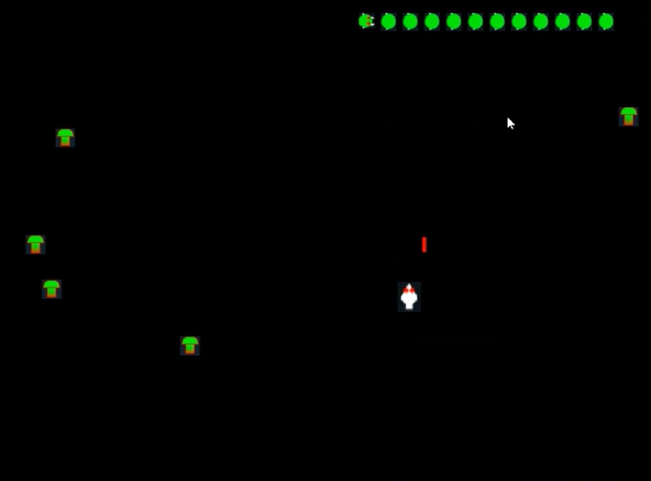

# Centipede Game

A modern recreation of the classic **Centipede arcade game**, built from scratch using **C++** and **SFML**.

---

## Features

- Classic Centipede-style movement and gameplay
- Responsive player-controlled starship
- Shooting mechanics with laser collisions
- Mushroom spawning and interaction
- Enemy AI: centipedes, spiders with randomized movement
- Game-over logic and player lives
- Clean modular codebase (C++/SFML)

---



---

## Built With

- [SFML 2.5.x](https://www.sfml-dev.org/) – Simple and Fast Multimedia Library
- C++17

---

## Getting Started

### Prerequisites

- C++17 compiler
- SFML installed (headers + libraries)
- CMake

### Build Instructions

```bash
# Clone the repo
git clone https://github.com/eskwak/Centipede.git
cd Centipede

```
# Compile
- Set Centipede/ root directory as CMake source
- Set Centipede/build directory as CMake target
